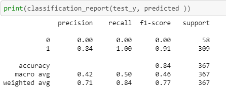
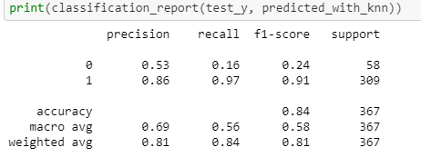

# loan_prediction
This Repository contains Loan Prediction Model 

## This project is about loan prediction where we will predict whether the customer should be given loan or not.
## Here I have used Machine Learning models to predicting the our target variable i.e. Loan Status column.

### The dataset for this project is divided into train and test two separate csv files.
### The training dataset for this project is named as train_AV3.csv.
#### The train dataset contains many null or nan values for many columns, so i have done the preprocessing steps in my project model notebook. I have also map our categorical columns also into integer as require by our machine learning algorithms.

### The test dataset is named as test_AV3.csv.
#### Test dataset also have same features as train csv file.

Software Required :-
1. Anaconda
2. Python(3.6 or higher)
3. Jupyter Notebook

Libraries Used :-
1. Numpy
2. Pandas
3. Matplotlib

#### I have used 4 Machine Learning Algorithms for this model. The 4 algorithms used are:-
1. Support Vector Machines(SVM)
2. Logistic Regression
3. K Nearest Neighbour(KNN)
4. Decision Tree

The 2 best algorithms which do best on this type of problem is Support Vector Machines and K Nearest Neighbour

For Support Vector Machines the Classification Report is given below:-

For K Nearest Neighbour the Classification is:-

